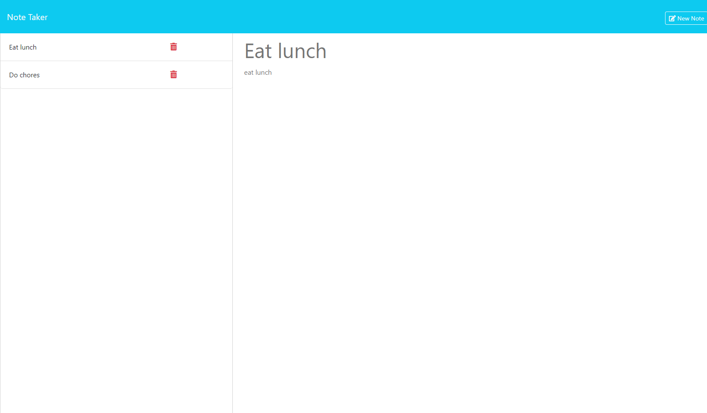

# Note Taker

## Description

- This project allows users to create notes. These notes are shared with all users that come to this website. A user is allowed to create a new note or delete notes that have been already created. As stated before, since the notes are shared among all users, users can delete notes that other users have created.

- This project was created to practice creating servers and HTTP requests with ExpressJS. The methods that were used were: "GET" to retrieve data from a JSON file, "POST" to add data to the JSON file, and "DELETE" to delete specific data from the JSON file. Additionally, modular routing was utilized in order to create a clean, non-cluttered structure.

- To try out this website application, visit: https://notetaker-i88g.onrender.com/

## Assets

Below is an image of the notes page

